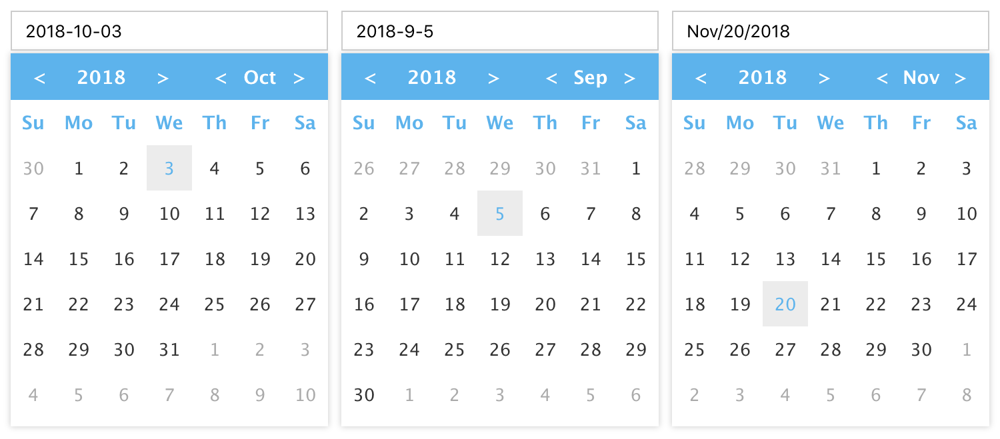

# vue-date-picker

[![npm version][npm-image]][npm-url] [![david deps][david-image]][david-url] [![npm license][license-image]][download-url]

datepicker component for Vue 2.x

## Screenshot



## Instllation

```bash
$ npm install vue-date-picker --save
```

## Usage

```html
<template>
  <div class="demo">
    <datepicker :readonly="true" format="YYYY-MM-DD" name="date1"></datepicker>
    <datepicker value="2018-9-5" format="YYYY-M-D" name="date2"></datepicker>
    <datepicker :readonly="true" format="MMM/D/YYYY" name="date3" :input-attr="{ 'data-test': 'value' }"></datepicker>
  </div>
</template>

<script>
import datepicker from 'vue-date-picker'

export default {
  components: {
    datepicker
  }
}
</script>
```

## Prop

| Prop                          | Type               | Default     | Description                              |
|-------------------------------|--------------------|:-----------:|------------------------------------------|
| value                         | String             | --          | Date value of the datepicker             |
| name                          | String             | --          | Input name property                      |
| format                        | String             | YYYY-MM-DD  | Date formatting string                   |
| readonly                      | String             | false       | Input readonly property                  |
| input-class                   | Array \| Object    | --          | Binding class for input                  |
| input-style                   | Array \| Object    | --          | Binding inline style for input           |
| input-attr                    | Object             | --          | Binding attribute for input              |
| calendar-class                | Array \| Object    | --          | Binding class for calendar               |
| calendar-style                | Array \| Object    | --          | Binding inline style for calendar        |
| calendar-attr                 | Object             | --          | Binding attribute for calendar           |
| disabled-date                 | Function           | --          | A function that determines if you want to disable dates |

## License

[The MIT License](http://opensource.org/licenses/MIT)

[npm-image]: https://img.shields.io/npm/v/vue-date-picker.svg?style=flat-square
[npm-url]: https://npmjs.org/package/vue-date-picker
[david-image]: https://img.shields.io/david/8788/vue-date-picker.svg?style=flat-square
[david-url]: https://david-dm.org/8788/vue-date-picker
[download-url]: https://npmjs.org/package/vue-date-picker
[license-image]: https://img.shields.io/npm/l/vue-date-picker.svg